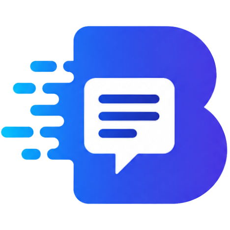
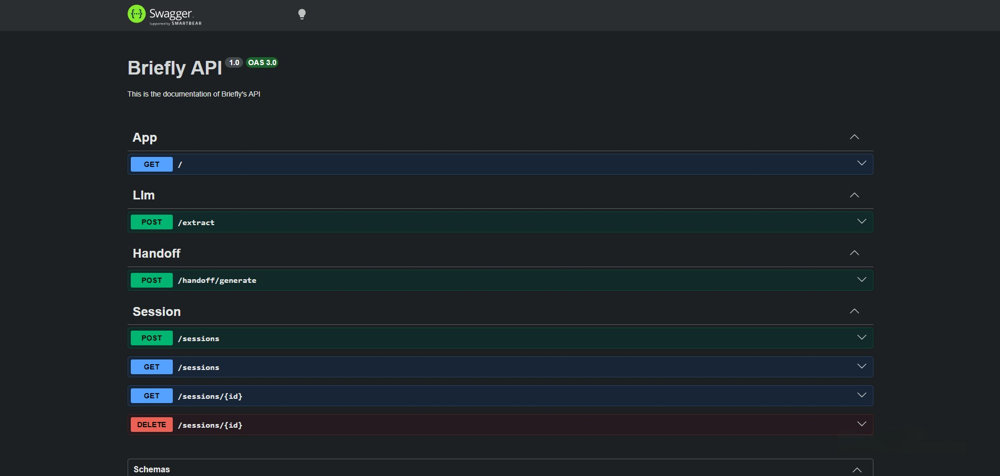
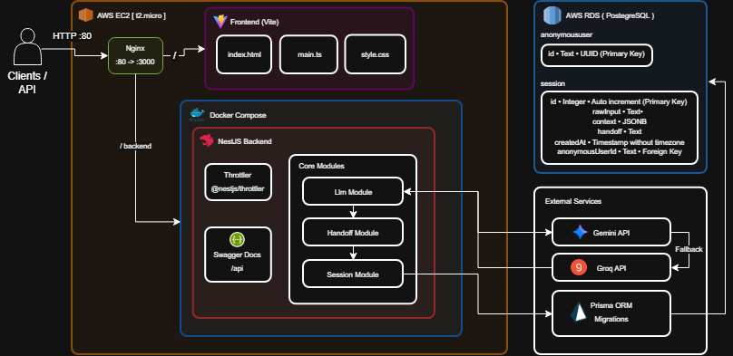

<p align="center">
  
</p>

# Briefly

A developer context handoff tool that compresses long AI coding conversations into structured project context, making it easy to continue work across AI assistants while reducing unnecessary token usage.


> As a free-tier AI user and backend developer, I frequently hit AI usage limits while building projects. Switching to another AI meant copying entire conversations just to restore context. While that worked, it also carried thousands of unnecessary tokens, consumed more of my limited AI usage, and often caused the next AI to process information it didn't actually need. I built Briefly to extract only the project context that matters, making it easier to continue coding across AI assistants without carrying the entire conversation.

## Table of Contents
- [Core Features](#core-features)
- [Tech Stack](#tech-stack)
- [Project Setup](#project-setup)
- [Environment Configuration](#environment-configuration)
- [Running the App](#running-the-app)
- [Production Deployment & Nginx](#production-deployment--nginx-configuration)
- [API Endpoints](#api-endpoints)
- [Data Models](#data-models)
- [Swagger API Docs](#api-documentation-swagger)
- [Architecture Diagram](#architecture-diagram)
- [Video Demo](#video-demo)

## Core Features

- **AI Context Extraction** - Extracts the essential project context from long AI coding conversations, including the current state, technical decisions, previous attempts, and next steps.
- **Developer Handoff Generation** - Generates a structured prompt that allows developers to continue working in another AI assistant without re-explaining their project.
- **Cross-AI Compatibility** - Works with ChatGPT, Claude, Gemini, and other AI assistants by producing provider-agnostic handoff prompts.
- **Token Optimization** - Removes unnecessary conversation history to reduce token usage and maximize the available context window.
- **Rate Limiting** - Protects AI endpoints with IP-based request throttling to prevent abuse and preserve API quotas.
- **API Documentation** - Interactive Swagger (OpenAPI) documentation for exploring and testing API endpoints.
- **Session History** - Save and reopen previous project contexts without requiring user authentication.
- **Anonymous Sessions** - Persist project history using anonymous user IDs, allowing developers to continue where they left off without creating an account.

## Tech Stack

- **Runtime** - Node.js with NestJS framework
- **Languages** - TypeScript, HTML5, CSS3
- **Database** - PostgreSQL with Prisma ORM
- **Artificial Intelligence** - Gemini API, Groq API
- **API Documentation** - Swagger (OpenAPI)
- **Security** - @nestjs/throttler (Rate Limiting)
- **Deployment & Infrastructure** - AWS EC2, AWS RDS, Nginx (Reverse Proxy)
- **Containerization** - Docker & Docker Compose

## Project Setup

```bash
cd backend/      # Install backend dependencies
npm install

cd frontend/     # Install frontend dependencies
npm install
```

[Back to Top](#table-of-contents)

## Environment Configuration
Create a `.env` file in the `backend/` directory.

```env
# DATABASE CONFIG
DATABASE_URL="your_database_url"

# GEMINI
GEMINI_API_KEY=your-gemini-api-key

# GROQ
GROQ_API_KEY=your-groq-api-key

# SYSTEM LISTENS TO ?
PORT=3000

# if you use postgresql add the credentials as:
POSTGRES_USER=your-user
POSTGRES_PASSWORD=your-password
POSTGRES_DB=your-database
```
[Back to Top](#table-of-contents)

## Running the App

### Local Development

```bash
# development with watch mode
docker compose up --build db pgadmin     # runs the database and the postgres gui

cd backend/
npm run start:dev

cd frontend/
npm run dev

# debug mode
cd backend/
npm run start:debug

# Run app through docker
docker compose up -d --build

cd frontend/
npm run dev
```

[Back to Top](#table-of-contents)

## Production Deployment & Nginx Configuration

```bash
git clone https://github.com/Mykeleganerz/briefly.git       # clone the repo

nano .env.docker                                            # create a .env.docker file

cd frontend                                                 # build the frontend
npm install
npm run build

cd backend                                                  # build the backend
docker compose up -d --build                                

```

The API is deployed on an AWS EC2 instance. Traffic entering through port 80 (HTTP) or 443 (HTTPS) is handled by Nginx, which acts as a reverse proxy, forwarding requests securely to the frontend and NestJS application running on port 3000.
```bash
sudo nano etc/nginx/sites-available/briefly                 # edit the nginx and put whats below
```

```nginx
server {
    listen 80;
    server_name <your_domain_or_ec2_ip>;

    # Serve frontend static files
    location / {
        root /home/ubuntu/briefly/frontend/dist;
        index index.html;
        try_files $uri $uri/ /index.html;
    }

    # Proxy backend calls to NestJS
    location /backend/ {
        proxy_pass http://localhost:3000/;
        proxy_http_version 1.1;
        proxy_set_header Upgrade $http_upgrade;
        proxy_set_header Connection 'upgrade';
        proxy_set_header Host $host;
        proxy_cache_bypass $http_upgrade;
        proxy_set_header X-Real-IP $remote_addr;
        proxy_set_header X-Forwarded-For $proxy_add_x_forwarded_for;
    }
}
```
To save:

```bash
sudo nginx -t
sudo systemctl restart nginx
```

[Back to Top](#table-of-contents)

## API Endpoints
can be seen in swagger 'localhost:3000/api'

### Llm

| Method | Endpoint | Description |
|--------|----------|-------------|
| POST | `/extract` | extracts the raw text to a context in JSON format |

### Handoff

| Method | Endpoint | Description |
|--------|----------|-------------|
| POST | `/handoff/generate` | converts the extracted context in a structured prompt |

### Session
| Method | Endpoint | Description |
|--------|----------|-------------|
| POST | `/sessions` | adds a new session after generating the handoff |
| GET | `/sessions` | displays all the sessions of the anonymous user |
| GET | `/sessions/{id}` | displays a specific session of the anonymous user |
| DELETE | `/sessions/{id}` | deletes a specific session of the anonymous user |

[Back to Top](#table-of-contents)

## Request/Response Examples

### POST /extract – extracts the raw text to a context in JSON format

**Request Body:**
```json
{
  "text": "your-raw-ai-conversation",
}
```

**Response (200):**
```json
{
  "techStack": [
    "NestJS",
    "Node.js"
  ],
  "projectName": "Briefly",
  "problem": "The user's NestJS code for interacting with the Google GenAI API has several errors, including incorrect API key handling, wrong SDK method calls, and an invalid model name. The goal is to fix the code to correctly use the Gemini API.",
  "triedAndFailed": [
    {
      "approach": "Using `interactions.create` with `gemini-3.5-flash` and `input` parameter.",
      "outcome": "Initially suggested as incorrect, then confirmed as correct by the AI after reviewing documentation, but the API key was still an issue."
    },
    {
      "approach": "Using `ai.models.generateContent` with `gemini-2.5-flash` and `contents` parameter.",
      "outcome": "This was a suggested fix based on a misunderstanding of the SDK version, but the user's original approach was closer to the correct implementation for the specified SDK."
    }
  ],
  "currentState": "The NestJS `LlmService` code has been corrected to properly use the `@google/genai` SDK, specifically the `ai.interactions.create` method with `gemini-3.5-flash`, and to correctly read the API key from environment variables. The AI also clarified why constructor, super, extends, and implements are not strictly necessary for the current implementation but suggested using a constructor with `ConfigService` for a more idiomatic NestJS approach in the future.",
  "unresolvedQuestions": [],
  "nextStep": "The user might want to implement error handling for fallback mechanisms (e.g., Groq) and integrate `ConfigService` for API key management.",
  "conversationSummary": "The user provided NestJS code using the Google GenAI SDK and asked for corrections. The AI initially provided a fix assuming an older SDK version and incorrect model name. After the user pointed to documentation, the AI corrected itself, identifying the primary issue as incorrectly reading the API key from environment variables (missing quotes). The AI also explained the usage of NestJS class decorators like constructor, extends, and implements in the context of the provided service, suggesting a future improvement using `ConfigService` for API key management."
}
```

### POST /handoff/generate – converts the extracted context in a structured prompt

**Request Body:**
```json
{
  "techStack": [
    "NestJS",
    "Node.js"
  ],
  "projectName": "Briefly",
  "problem": "The user's NestJS code for interacting with the Google GenAI API has several errors, including incorrect API key handling, wrong SDK method calls, and an invalid model name. The goal is to fix the code to correctly use the Gemini API.",
  "triedAndFailed": [
    {
      "approach": "Using `interactions.create` with `gemini-3.5-flash` and `input` parameter.",
      "outcome": "Initially suggested as incorrect, then confirmed as correct by the AI after reviewing documentation, but the API key was still an issue."
    },
    {
      "approach": "Using `ai.models.generateContent` with `gemini-2.5-flash` and `contents` parameter.",
      "outcome": "This was a suggested fix based on a misunderstanding of the SDK version, but the user's original approach was closer to the correct implementation for the specified SDK."
    }
  ],
  "currentState": "The NestJS `LlmService` code has been corrected to properly use the `@google/genai` SDK, specifically the `ai.interactions.create` method with `gemini-3.5-flash`, and to correctly read the API key from environment variables. The AI also clarified why constructor, super, extends, and implements are not strictly necessary for the current implementation but suggested using a constructor with `ConfigService` for a more idiomatic NestJS approach in the future.",
  "unresolvedQuestions": [],
  "nextStep": "The user might want to implement error handling for fallback mechanisms (e.g., Groq) and integrate `ConfigService` for API key management.",
  "conversationSummary": "The user provided NestJS code using the Google GenAI SDK and asked for corrections. The AI initially provided a fix assuming an older SDK version and incorrect model name. After the user pointed to documentation, the AI corrected itself, identifying the primary issue as incorrectly reading the API key from environment variables (missing quotes). The AI also explained the usage of NestJS class decorators like constructor, extends, and implements in the context of the provided service, suggesting a future improvement using `ConfigService` for API key management."
}
```
**Response (201):**
```text
=== CONTEXT HANDOFF — Briefly ===

The following contains extracted context from a previous AI conversation.
Treat this as the current state of the project and continue from here.

IMPORTANT INSTRUCTIONS:
- Only use the information provided below. Do not invent or assume missing
details.
- If a field says 'Not provided', ask for clarification before proceeding.
- Do not restart the project or repeat steps already completed.
- Do not retry previously failed approaches unless you can explain why a
variation would differ.
- Respect existing architecture and technology decisions.
- Focus on the Next Step and Unresolved Questions first.
- Provide practical guidance with code examples where helpful.

─────────────────────────────────

PROJECT NAME:
Briefly

TECH STACK:
- NestJS
- Node.js

PROBLEM:
The user's NestJS code for interacting with the Google GenAI API has several
errors, including incorrect API key handling, wrong SDK method calls, and an
invalid model name. The goal is to fix the code to correctly use the Gemini API.

WHAT WAS TRIED (AND FAILED):
1. Approach: Using `interactions.create` with `gemini-3.5-flash` and `input`
parameter.
Outcome: Initially suggested as incorrect, then confirmed as correct by the AI
after reviewing documentation, but the API key was still an issue.
2. Approach: Using `ai.models.generateContent` with `gemini-2.5-flash` and
`contents` parameter.
Outcome: This was a suggested fix based on a misunderstanding of the SDK
version, but the user's original approach was closer to the correct
implementation for the specified SDK.

CURRENT STATE:
The NestJS `LlmService` code has been corrected to properly use the
`@google/genai` SDK, specifically the `ai.interactions.create` method with
`gemini-3.5-flash`, and to correctly read the API key from environment
variables. The AI also clarified why constructor, super, extends, and implements
are not strictly necessary for the current implementation but suggested using a
constructor with `ConfigService` for a more idiomatic NestJS approach in the
future.

UNRESOLVED QUESTIONS:
- Not provided

NEXT STEP:
The user might want to implement error handling for fallback mechanisms (e.g.,
Groq) and integrate `ConfigService` for API key management.

CONVERSATION SUMMARY:
The user provided NestJS code using the Google GenAI SDK and asked for
corrections. The AI initially provided a fix assuming an older SDK version and
incorrect model name. After the user pointed to documentation, the AI corrected
itself, identifying the primary issue as incorrectly reading the API key from
environment variables (missing quotes). The AI also explained the usage of
NestJS class decorators like constructor, extends, and implements in the context
of the provided service, suggesting a future improvement using `ConfigService`
for API key management.

=================================
Continue from here.
```
### Error Responses

**500 Internal Server Error** – Both AI providers failed to extract context.
```json
{
  "statusCode": 500,
  "message": "Both AI providers failed to extract context. Please try again later."
}
```

**429 Too Many Requests** – Rate limit of Briefly:
```json
{
  "statusCode": 429,
  "message": "Too Many Requests, only 5 attempts for 60 seconds."
}
```

**404 Not Found** – Session doesn't exist:
```json
{
  "statusCode": 404,
  "message": "Session not found."
}
```

**400 Bad Request** – Validation error:
```json
{
  "message": [
    "each value in techStack must be a string"
  ],
  "error": "Bad Request",
  "statusCode": 400
}
```

[Back to Top](#table-of-contents)

## Data Models

### Anonymous User
| Field | Type | Description |
|-------|------|-------------|
| `id` | Text | UUID (Primary key) |

### Sessions
| Field | Type | Description |
|-------|------|-------------|
| `id` | Integer | Primary key (auto-increment) |
| `rawInput` | Text | Raw input text |
| `context` | JSONB | Context came from /extract |
| `handoff` | Text | Generated handoff from extract |
| `createdAt` | Timestamp without timezone | Created timestamp |
| `anonymousUserId` | Text | Foreign key of anonymous user id |

[Back to Top](#table-of-contents)

## API Documentation (Swagger)
This project uses Swagger for interactive API documentation, allowing you to explore and test all endpoints directly from your browser.

Once the application is running, access the interactive Swagger UI at:
```http://localhost:3000/api```



## Architecture Diagram



## Video Demo

[](https://youtu.be/c4adQFbKMP4)

[Back to Top](#table-of-contents)
